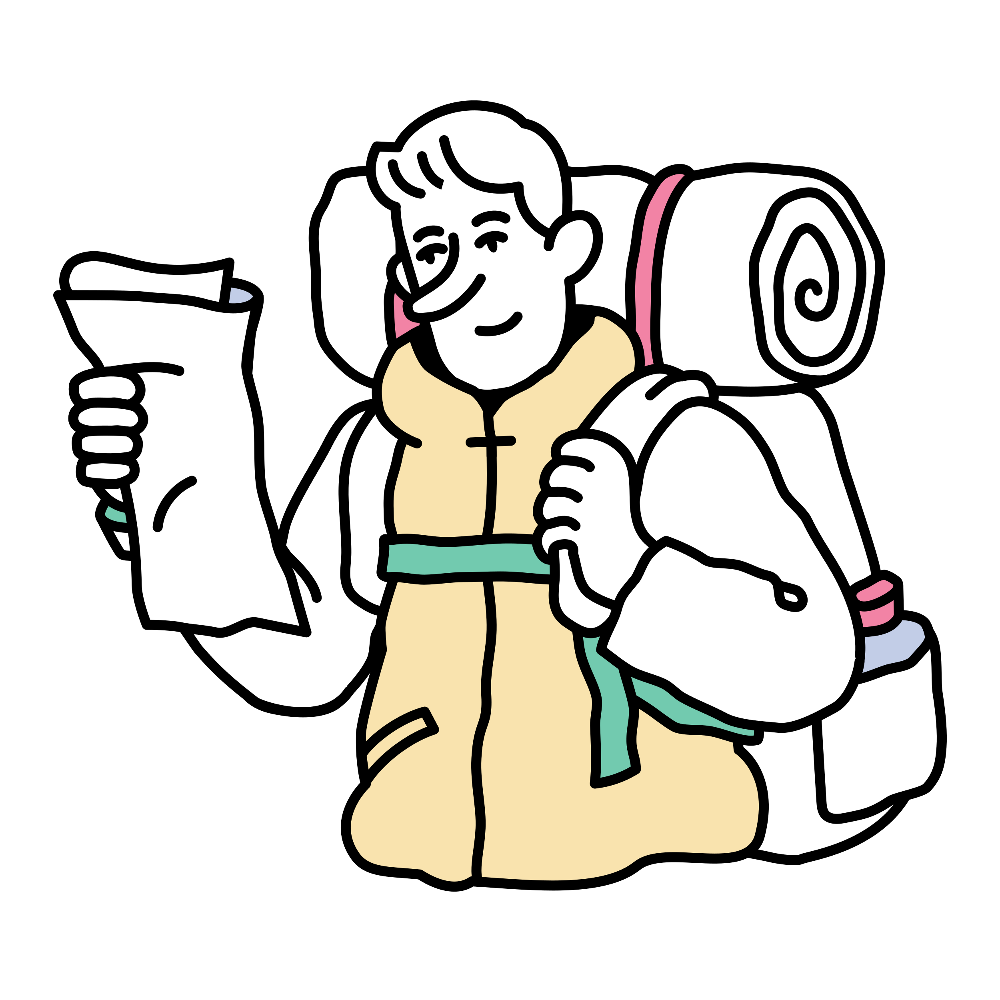

# 🌟 Hello World 🌟  

Welcome to my **"Hello World"** repository—a personal space that goes beyond code to showcase the essence of who I am. This isn’t just about programming; it’s about curiosity, creativity, and connection. Dive in to discover the unique blend of my interests and passions that fuel my journey. 🌍✨

---

## 🚀 **The Wonders of Tech**  
Technology is my playground, and its miracles fascinate me daily. From **AI** shaping intelligence to the marvels of **robotics**, and exploring the intricate details of **laptop hardware**, I thrive in the limitless possibilities of innovation.  

  
  

---

## 🌌 **Exploring the Metaverse**  
The metaverse captivates me with its ability to redefine how we work, communicate, and create. Its potential to unlock new dimensions of collaboration and creativity is simply magical.  

  

---

## 💡 **A Creator at Heart**  
I love crafting new ideas, bringing concepts to life, and exploring the boundaries of creativity. There's nothing more exciting than seeing an idea grow into something meaningful.  

  

---

## 🌲 **Nature: My Sanctuary**  
Beyond tech, I find solace in **camping** and being surrounded by nature. It’s where I connect deeply with life and rediscover myself. Nature fuels my creativity and keeps me grounded, inspiring innovative thoughts and inner peace.  

  
  

---

## 🌸 **Floral Fascination**  
I adore flowers and often find myself reading about them. **Gerbera** is my all-time favorite—its vibrant beauty reflects the optimism and joy I strive to bring to life.  

  

---

## 🌟 **Why This Matters**  
This repository isn’t just a "Hello World" in the technical sense—it’s my **hello to you**, the reader. It’s a glimpse into the things that drive me, inspire me, and make me who I am.  

So whether you're here to learn about me, collaborate on a project, or just say hi—welcome! Let’s build, create, and grow together. 🌍✨  

---

### 🙌 Connect with Me  
- **LinkedIn:** [www.linkedin.com/in/mohamed-rayen-gharbi](#)
- **Medium:** [https://medium.com/@RayenAYO](#)

---

> *"Innovation is born from curiosity, nurtured by creativity, and flourishes in connection."*
